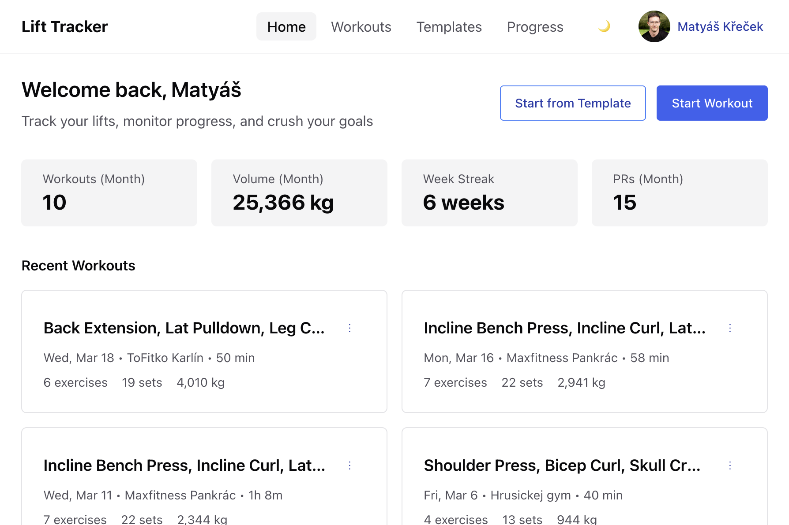
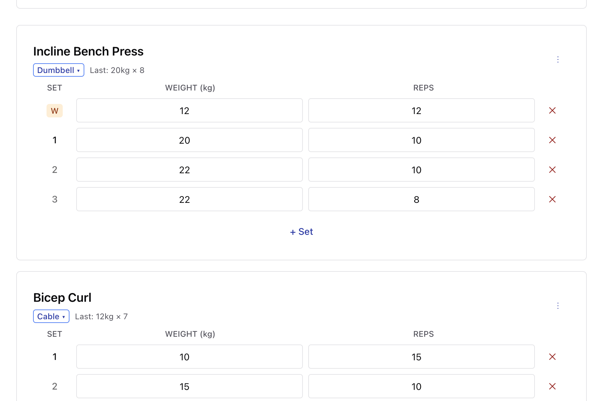
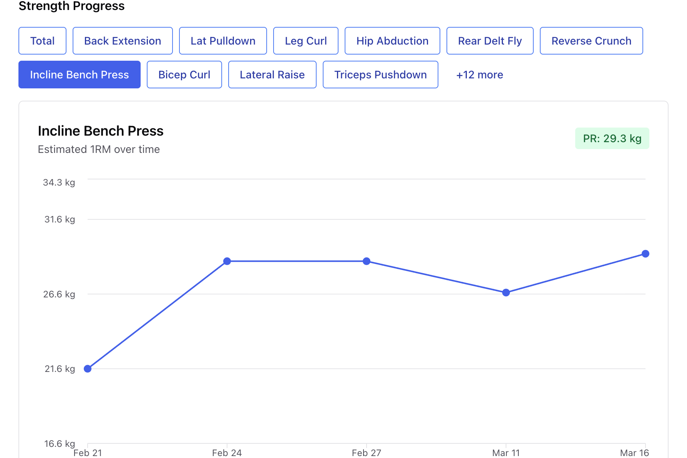

# Lift Tracker

A no-nonsense weightlifting app for people who just want to log their workouts and track progress. Fork and host your own!

## Screenshots

### Dashboard



### Workout Logging



### Progress Tracking



## Features

- Start a blank workout or use a saved template
- Add exercises from a shared catalog — search with AI if you don't know the exact name
- The exercise catalog grows organically: when AI search finds an exercise that isn't in the database yet, it gets added automatically for everyone
- Log sets with weight and reps — that's it
- See your estimated 1RM trends per exercise
- Track personal records automatically
- View weekly training volume
- Save workout routines as templates
- Track where you train (home gym, commercial gym, etc.)

## Philosophy

No social feeds. No AI coaches. No complex periodization schemes.

Just log your lifts, see your progress, and get back to training.

## Tech Stack

- **Next.js** (App Router) — React framework
- **PostgreSQL** + **Prisma** — Database and ORM
- **Chakra UI v3** — Component library
- **better-auth** — Authentication (Google OAuth)
- **SWR** — Client-side data fetching and cache
- **Vercel AI SDK** — AI-powered exercise search

## Getting Started

### Prerequisites

- [Node.js](https://nodejs.org/) (v20+)
- [Docker](https://www.docker.com/) (for local PostgreSQL)

### Setup

```bash
# Install dependencies
npm install

# Copy environment file and fill in values (see below)
cp .env.example .env

# Start local PostgreSQL
npm run db:start

# Generate Prisma client
npm run db:generate

# Push schema to database
npm run db:push

# Seed the exercise catalog
npm run db:seed

# Start dev server
npm run dev
```

The app will be available at [http://localhost:3000](http://localhost:3000).

### Environment Variables

| Variable | Required | Description |
|---|---|---|
| `DATABASE_URL` | Yes | PostgreSQL connection string. Default works with the included `docker-compose.yml`. |
| `BETTER_AUTH_SECRET` | Yes | Random string (32+ characters) used to sign auth tokens. |
| `BETTER_AUTH_URL` | Yes | App base URL (`http://localhost:3000` for local dev). |
| `GOOGLE_CLIENT_ID` | Yes | Google OAuth client ID from [Google Cloud Console](https://console.cloud.google.com/apis/credentials). |
| `GOOGLE_CLIENT_SECRET` | Yes | Google OAuth client secret. |
| `AI_GATEWAY_API_KEY` | No | API key for AI-powered exercise search. The app works without it — AI search will be unavailable. |

### Google OAuth Setup

1. Go to [Google Cloud Console](https://console.cloud.google.com/apis/credentials)
2. Create an OAuth 2.0 Client ID (Web application)
3. Add `http://localhost:3000` to **Authorized JavaScript origins**
4. Add `http://localhost:3000/api/auth/callback/google` to **Authorized redirect URIs**
5. Copy the Client ID and Client Secret into your `.env`

## Self-Hosting

A production-ready `Dockerfile` is included. Build and run with any container hosting platform:

```bash
docker build -t lift-tracker .
docker run -p 3000:3000 --env-file .env lift-tracker
```

Make sure to set all required environment variables. `BETTER_AUTH_URL` must match the public URL of your deployment. Also add your domain to the list of allowed origins in the Google Cloud Console.

## License

[MIT](LICENSE)
